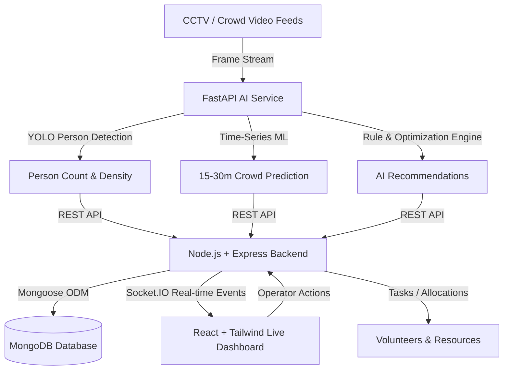

# Vari Smart Operations Platform

> **AI-Powered Command Platform for Crowd, Mobility & Resource Management**  
> Motto: **SENSE → PREDICT → OPTIMIZE → ACT**  
> Track 2: Crowd, Mobility & Resource Management (Deep Learning Subject Project & Hackathon MVP)

---

## 📌 Executive Pitch
**Vari Smart Operations** is an AI-powered operational command platform that leverages deep learning computer vision (YOLO) and real-time analytics to monitor crowd movements, predict operational bottlenecks, coordinate volunteer deployment, and optimize vital resources (food, water, sanitation) during large-scale pilgrimages such as the Vari.

---

## 🏛️ System Architecture



---

## 📁 Repository Structure

```text
CROWD_MANAGEMENT_SYSTEM/
├── frontend/             # React.js + Vite + Tailwind CSS + Recharts + Leaflet
├── backend/              # Node.js + Express + Socket.IO + MongoDB (Mongoose)
├── ai-service/           # Python + FastAPI + YOLO (Ultralytics) + OpenCV + Scikit-learn
├── data/                 # Video inputs & simulated telemetry
│   ├── videos/           # Sample crowd video clips for inference
│   └── simulated/        # Time-series datasets & historical patterns
├── docs/                 # API documentation, zone configurations & schemas
└── Documentation/        # Client brief and implementation roadmap
```

---

## ⚙️ Quick Start

### 1. Prerequisites
- **Node.js** v18+ (verified with v22.14.0)
- **Python** 3.10+ (verified with v3.10.8)
- **MongoDB** Community Server running locally on port 27017 or MongoDB Atlas

### 2. Backend Setup
```bash
cd backend
npm install
npm run dev
# Server running at http://localhost:5000
# Health check: http://localhost:5000/api/health
```

### 3. AI Service Setup
```bash
cd ai-service
pip install -r requirements.txt
uvicorn main:app --reload --port 8000
# AI Service API running at http://localhost:8000
# Swagger Docs: http://localhost:8000/docs
```

### 4. Frontend Setup
```bash
cd frontend
npm install
npm run dev
# Dashboard running at http://localhost:5173
```

---

## 🚦 Operational Risk Matrix

$$\text{Density (\%)} = \left( \frac{\text{Current People Count}}{\text{Zone Capacity}} \right) \times 100$$

| Density | Risk Level | Operational Response |
|:---|:---|:---|
| **< 60%** | `SAFE` (Green) | Normal flow monitoring |
| **60% – 85%** | `MODERATE` (Yellow) | Heightened alertness, standby advisory |
| **85% – 100%** | `HIGH` (Orange) | Deploy warning, prepare crowd diversion |
| **> 100%** | `CRITICAL` (Red) | Immediate alert, divert crowd to alternate gates, deploy volunteers |

---

## ⚖️ License & Disclaimer
*Note: All crowd telemetry, volunteer rosters, and resource figures used in the simulation mode are clearly tagged and simulated for demonstration purposes.*
