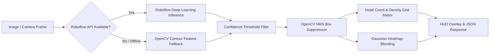

# 👁️ AI Crowd Detection & Security Alert Engine

> Documentation for the Roboflow Deep Learning Inference Model, OpenCV Non-Maximum Suppression (NMS) pipeline, and real-time vision analytics integrated into the Vari Smart Operations AI Service.

---

## 🤖 Model Specifications

- **Model ID**: `crowd-detection-n30gw/3`
- **Hosted Inference Provider**: Roboflow Serverless (`https://serverless.roboflow.com`)
- **Fallback Vision Engine**: OpenCV Adaptive Thresholding + Contour Head/Person Filtering (guarantees local operation even when offline or unauthenticated).
- **Suppression Algorithm**: Non-Maximum Suppression (NMS) via OpenCV DNN module (`cv2.dnn.NMSBoxes`).
- **Heatmap Computation**: 2D Gaussian density estimation normalized and color-mapped via `cv2.COLORMAP_JET`.
- **Spatial Matrix**: 5x5 normalized spatial density grid for HUD and front-end rendering.

---

## ⚙️ Detection Pipeline Architecture

---

## 📡 API Endpoints in AI Service (`ai-service`)

| Endpoint | Method | Description |
| :--- | :--- | :--- |
| `/` | `GET` | Service root and link to SOC Dashboard & docs |
| `/soc` | `GET` | Live Security Operations Center (SOC) interactive monitoring UI |
| `/health` | `GET` | Health status and ML/DL library availability probe |
| `/api/density-check` | `POST` | Core Vari Smart Ops density & risk level calculation |
| `/detect-crowd` | `POST` | End-to-end detection endpoint (supports file upload or simulated payload) |
| `/api/analyze` | `POST` | Upload an image file for AI crowd detection, heatmap, and 5x5 spatial grid |
| `/api/stream` | `GET` | Live MJPEG video stream generator with real-time HUD annotations |
| `/api/stats` | `GET` | Retrieves current crowd counts, peak stats, and timeline |
| `/api/alerts` | `GET` | Fetches historical threat alert log |
| `/api/alerts/acknowledge` | `POST` | Acknowledges and resolves a specific alert ID |
| `/api/settings` | `GET / POST` | Reads or updates threat thresholds & AI parameters |

---

## 🧪 Testing Scripts

- `python ai-service/test_crowd.py`: Runs detection directly on `crowd.jpg` and saves annotated analysis with bounding boxes and heatmaps.
- `python ai-service/test_api.py`: Automated test suite testing all endpoints against the running FastAPI service.
